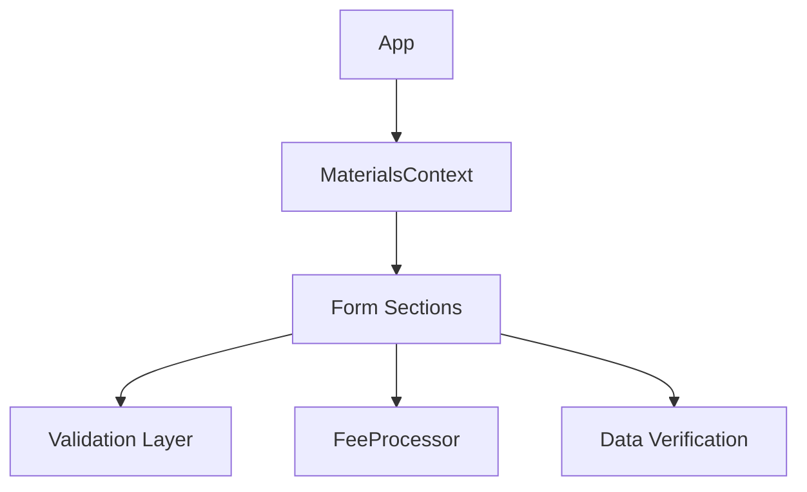

# System Patterns

## Architecture Overview
The system follows a React-based Single Page Application (SPA) architecture using TypeScript for type safety and Vite for build tooling.

## Core Components
1. Form Sections
   - BusinessDetails
   - ContactDetails
   - HazardousMaterials
   - PermitDetails
   Each section follows a consistent pattern with a main component and optional preamble component.

2. Material Management
   - MaterialCard for individual material entries
   - CommonHazmatCards for pre-defined materials
   - MaterialsContext for state management
   - FeeProcessor for cost calculations

3. UI Components
   - Modal for overlays
   - NavBar for navigation
   - FormSection for consistent section layout
   - SummaryModal for data review

## Design Patterns
1. Context Pattern
   - MaterialsContext manages shared state
   - Avoids prop drilling in deep component trees

2. Component Composition
   - Base components (FormSection)
   - Specialized components (MaterialCard)
   - Modal overlays for complex interactions

3. Validation Strategy
   - Schema-based validation
   - Form-level validation
   - Data verification helpers

4. Internationalization
   - i18n implementation
   - Locale files for en/es
   - Translation management

## Data Flow


## File Organization
```
src/
├── components/    # React components
├── helpers/       # Utility functions
├── locales/       # Translation files
└── scss/         # Styling
```

## Testing Strategy
1. Component Tests
   - React Testing Library
   - Component isolation
   - User interaction simulation

2. Utility Tests
   - Unit tests for helpers
   - Fee calculation verification
   - Validation testing
